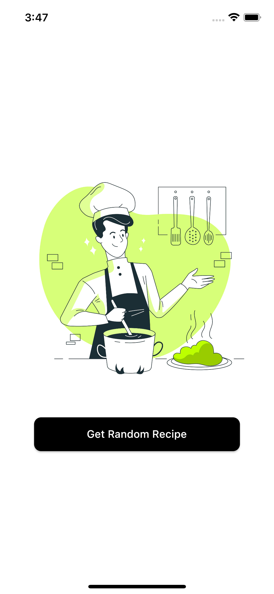
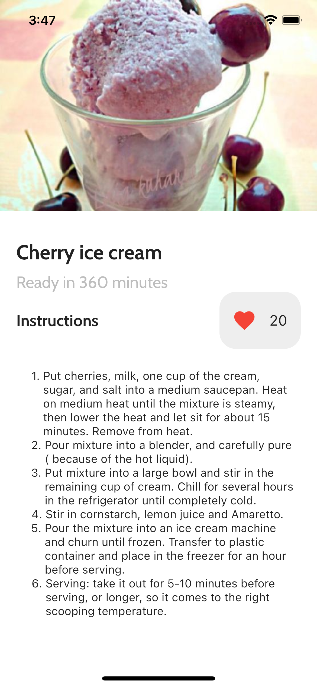

## Recipe App

Flutter Bloc Application with Clean Architecture

## Development Setup
Clone the repository and run the following commands:
```
flutter pub get
flutter run
```

## Screenshots

### Home


### Recipe


## Links
### Freepik images source
* [@stories](https://www.freepik.es/stories)
### Api
* [Spoonacular](https://spoonacular.com/)
